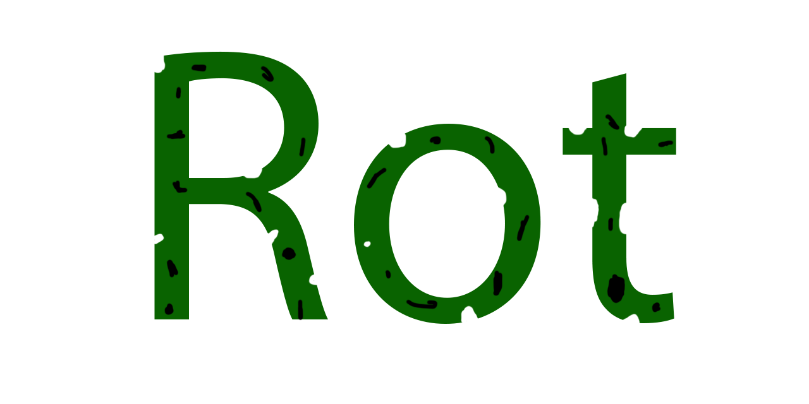

# rot-lang
A language focused on consistency and memory usage.

## Why the name "rot"
Thats because variables "rot" as they get accessed.  
Maybe a better name would be "erode", but thats long.  

## Consistency as in how?
Everything has predifined behaviour, and you can expect the same line of code to do the same thing consistently.

## Memory usage?
Since everything has a predined number of accesses, you can rely on variables getting cleaned up once they are used up.
Lifetimes are immutable, so you explicitly need to define a proper length lifetime at variable creation.

## How to run the proof of concept?
after you clone the repo:  
```bash
cd src
go run main.go
```
### Progress on the langauge: 
#### May not be in this order, but let see how far it gets.
- [x] Create variables, deallocate after lifetime ends  
- [x] Extend lifetimes and deallocate variables
- [x] Make it simple to develop  
- [x] Imports  
- [x] Lists
- [ ] User defined functions  
- [ ] Compile  
- [ ] Make it statically typed  
  
###### this is an esoteric language.
